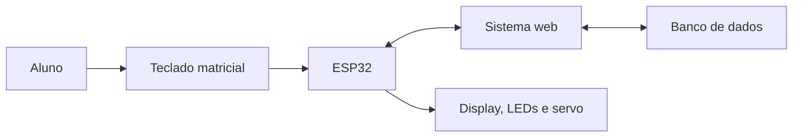
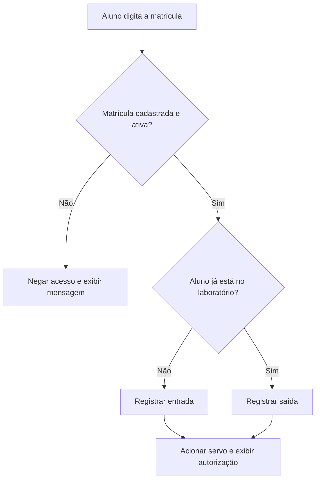
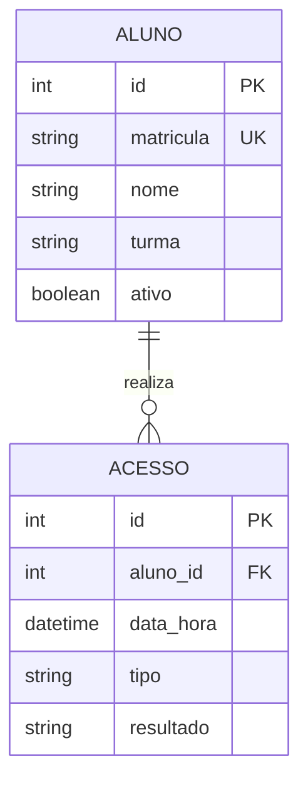

# Relatório de Arquitetura e Modelagem - AcessoLab

## 1. Visão geral

O **AcessoLab** será um sistema para registrar e controlar a entrada e a saída de alunos nos laboratórios de Informática e Robótica. O aluno digitará sua matrícula em um teclado matricial. O ESP32 enviará a matrícula pela rede Wi-Fi ao sistema, que consultará o banco de dados e retornará se o acesso foi autorizado ou negado.

Quando o acesso for autorizado, o ESP32 acionará um servo motor que representará a abertura da porta da maquete. O sistema também registrará a data, o horário e o tipo de movimentação: entrada ou saída.

## 2. Componentes previstos

| Componente | Função |
|---|---|
| ESP32 | Controlar o protótipo e comunicar-se com o sistema pela rede Wi-Fi. |
| Teclado matricial 4x4 | Permitir que o aluno digite a matrícula. |
| Servo motor | Representar a abertura e o fechamento da porta. |
| Display LCD ou OLED | Exibir mensagens de acesso autorizado ou negado. |
| LEDs verde e vermelho | Informar visualmente o resultado da tentativa. |
| Buzzer | Emitir um aviso sonoro. |
| Protoboard e jumpers | Realizar as conexões do circuito. |
| Sistema web | Cadastrar alunos e consultar o histórico. |
| Banco de dados | Armazenar alunos e registros de acesso. |

## 3. Arquitetura da solução

### Funcionamento das partes

- **Camada física:** teclado, ESP32, display, LEDs, buzzer e servo motor;
- **camada de comunicação:** conexão Wi-Fi entre o ESP32 e o sistema;
- **camada de aplicação:** sistema web responsável pela validação e administração;
- **camada de dados:** banco que armazenará os alunos e os acessos.

## 4. Fluxo de entrada e saída

## 5. Modelo inicial do banco de dados

Para manter o protótipo simples, serão utilizadas inicialmente duas tabelas.

### Tabela `aluno`

| Campo | Tipo sugerido | Descrição |
|---|---|---|
| id | Inteiro | Identificador único. |
| matricula | Texto | Matrícula única do aluno. |
| nome | Texto | Nome completo. |
| turma | Texto | Turma do aluno. |
| ativo | Booleano | Indica se o acesso está liberado. |

### Tabela `acesso`

| Campo | Tipo sugerido | Descrição |
|---|---|---|
| id | Inteiro | Identificador do registro. |
| aluno_id | Inteiro | Referência ao aluno. |
| data_hora | Data e hora | Momento da movimentação. |
| tipo | Texto | Entrada ou saída. |
| resultado | Texto | Autorizado ou negado. |

## 6. Protótipos das telas

### Tela de acesso

- Campo para matrícula;
- botão **Confirmar**;
- mensagem de acesso autorizado ou negado.

### Painel do responsável

- total de alunos presentes;
- lista de entradas e saídas recentes;
- pesquisa por matrícula, nome ou data;
- acesso ao cadastro de alunos.

### Cadastro de aluno

- nome completo;
- matrícula;
- turma;
- situação: ativo ou inativo;
- botões para salvar e cancelar.

## 7. Tecnologias previstas

| Área | Tecnologia prevista |
|---|---|
| Microcontrolador | ESP32 |
| Programação do protótipo | Arduino IDE / C++ |
| Interface | HTML, CSS e JavaScript |
| Servidor e API | A definir pela equipe |
| Banco de dados | SQLite ou outro banco simples |
| Gestão | Trello |
| Versionamento | GitHub |

## 8. Escopo do protótipo

A primeira versão será demonstrada em uma maquete e deverá validar a matrícula, registrar entrada e saída e movimentar o servo motor. A instalação em uma porta real, o leitor biométrico e a integração com sistemas oficiais da escola ficam fora do escopo inicial.

## 9. Equipe

- Fredy Gomes Martins;
- **[Integrante 2]**;
- **[Integrante 3]**.

---

**Versão:** 1.0  
**Disciplina:** Projeto Integrador II  
**Professor:** Clécio Sousa  
**Ano:** 2026
