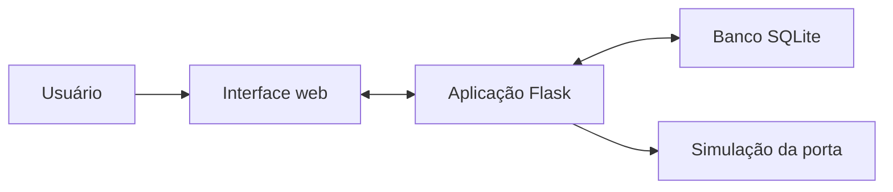
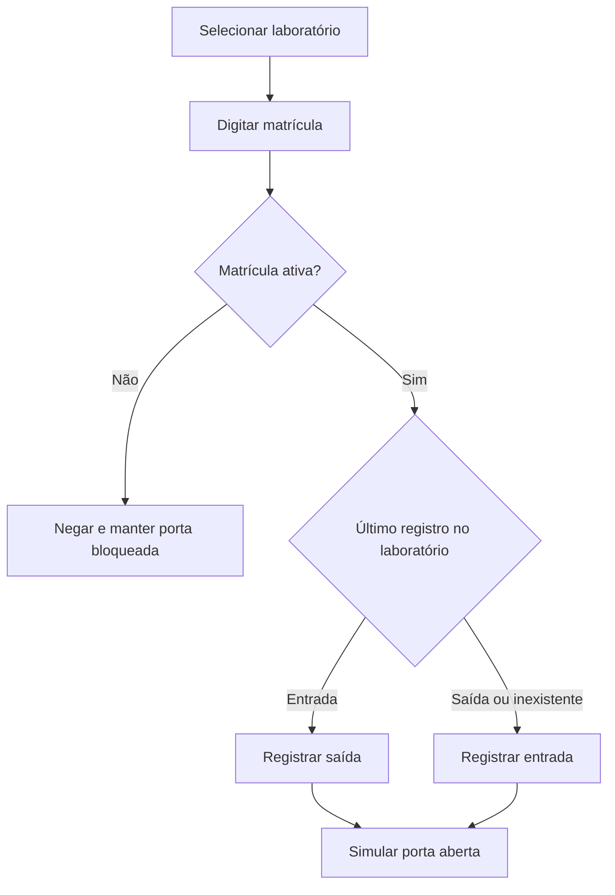
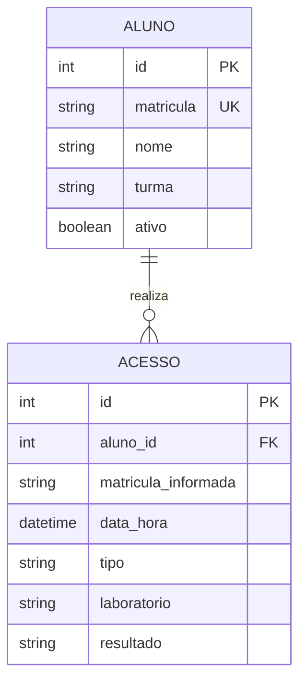

# Relatório de Arquitetura e Modelagem - AcessoLab

## 1. Visão geral

O AcessoLab é um protótipo virtual para controlar e registrar entradas e saídas em laboratórios. O usuário seleciona o laboratório e informa a matrícula. A aplicação Flask consulta o banco SQLite, registra a movimentação e apresenta uma simulação da porta aberta ou bloqueada.

Nesta versão não existe montagem física. A integração com ESP32, teclado e servo motor permanece como melhoria futura.

## 2. Arquitetura atual

### Camadas

- **Interface:** formulários, tabelas, mensagens e animação da porta;
- **aplicação:** validações e regras de entrada e saída em Python/Flask;
- **dados:** armazenamento local de alunos e acessos no SQLite;
- **simulação:** representação da porta e dos sinais verde e vermelho.

## 3. Fluxo de acesso

## 4. Banco de dados

### Tabela `alunos`

| Campo | Tipo | Descrição |
|---|---|---|
| id | Inteiro | Identificador único. |
| matricula | Texto | Matrícula única do aluno. |
| nome | Texto | Nome completo. |
| turma | Texto | Turma do aluno. |
| ativo | Booleano | Indica se o acesso está liberado. |

### Tabela `acessos`

| Campo | Tipo | Descrição |
|---|---|---|
| id | Inteiro | Identificador do registro. |
| aluno_id | Inteiro | Referência ao aluno, quando encontrado. |
| matricula_informada | Texto | Valor digitado na tentativa. |
| data_hora | Data e hora | Momento da movimentação. |
| tipo | Texto | Entrada, saída ou vazio em acesso negado. |
| laboratorio | Texto | Laboratório selecionado. |
| resultado | Texto | Autorizado ou negado. |

## 5. Telas

### Painel

- Seleção do laboratório;
- campo para matrícula;
- porta virtual;
- sinal de autorização ou negação;
- totais, presentes e movimentações recentes.

### Alunos

- Cadastro de nome, matrícula e turma;
- lista de estudantes;
- alteração entre ativo e inativo.

### Histórico

- Lista de tentativas e movimentações;
- laboratório, data, horário e resultado;
- pesquisa por nome, matrícula ou laboratório.

## 6. Tecnologias utilizadas

| Área | Tecnologia |
|---|---|
| Back-end | Python e Flask |
| Interface | HTML, CSS e Jinja |
| Banco de dados | SQLite |
| Gestão | Trello |
| Versionamento | GitHub |

## 7. Escopo

O escopo da versão 1.0.0 inclui somente a demonstração virtual do controle de acesso. ESP32, teclado matricial, display, LEDs e servo motor não foram montados ou testados. A rota `/api/acesso` foi mantida para facilitar uma possível integração futura.

---

**Versão:** 1.0.0  
**Autor:** Fredy Gomes Martins  
**Disciplina:** Projeto Integrador II  
**Professor:** Clécio Sousa  
**Ano:** 2026
