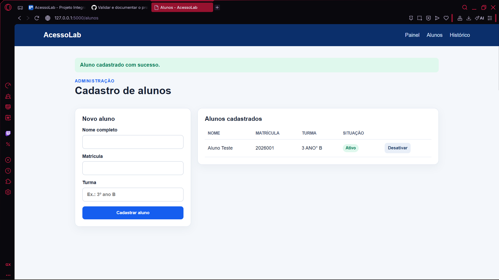
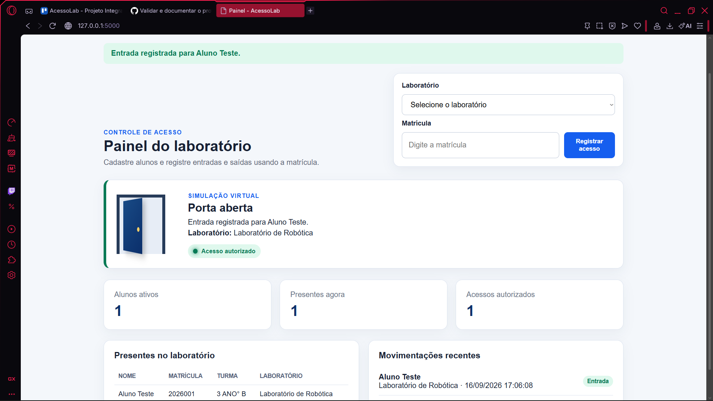
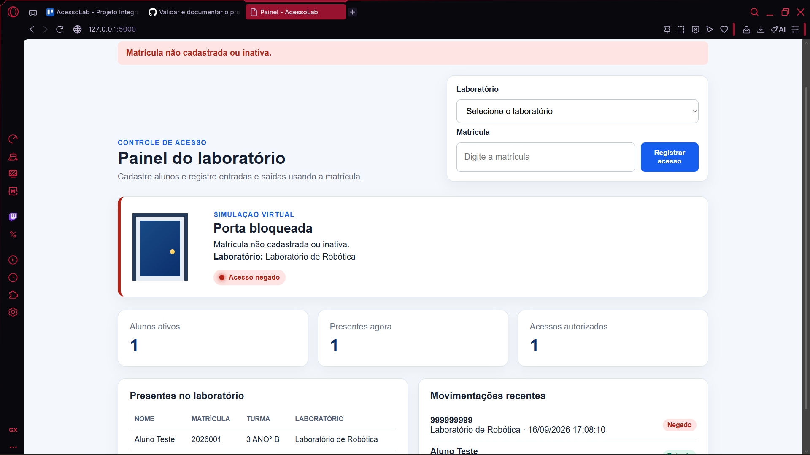
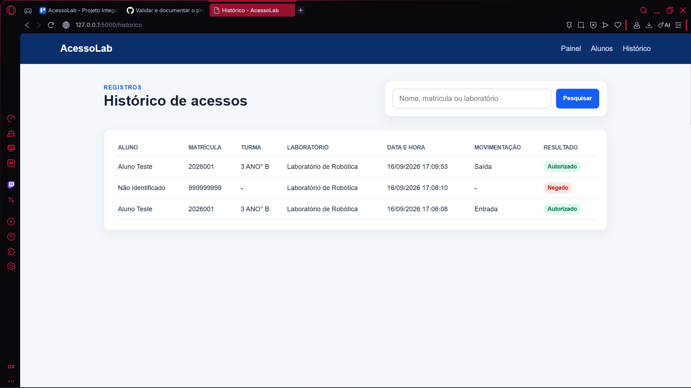

# Relatório de Validação - AcessoLab

## 1. Objetivo

Validar o funcionamento do protótipo virtual do AcessoLab, incluindo cadastro, seleção de laboratório, controle de acesso, simulação da porta e armazenamento no SQLite.

## 2. Ambiente

- Computador com Python 3;
- navegador web;
- aplicação Flask;
- banco de dados SQLite;
- execução local em `http://127.0.0.1:5000`.

> A validação desta versão é exclusivamente de software. Não foi utilizado ESP32, servo motor ou circuito físico.

## 3. Casos de teste

| Código | Procedimento | Resultado esperado | Resultado obtido | Situação |
|---|---|---|---|---|
| T01 | Cadastrar aluno com todos os campos. | Cadastro salvo. | Preencher após testar. | Pendente |
| T02 | Repetir uma matrícula cadastrada. | Sistema informa duplicidade. | Preencher após testar. | Pendente |
| T03 | Registrar matrícula ativa. | Entrada registrada, sinal verde e porta virtual aberta. | Preencher após testar. | Pendente |
| T04 | Repetir a matrícula no mesmo laboratório. | Saída registrada. | Preencher após testar. | Pendente |
| T05 | Informar matrícula inexistente. | Acesso negado, sinal vermelho e porta bloqueada. | Preencher após testar. | Pendente |
| T06 | Desativar um aluno e tentar acessar. | Acesso negado. | Preencher após testar. | Pendente |
| T07 | Testar os três laboratórios. | Laboratório correto salvo em cada registro. | Preencher após testar. | Pendente |
| T08 | Pesquisar nome, matrícula e laboratório. | Registros correspondentes exibidos. | Preencher após testar. | Pendente |
| T09 | Reiniciar a aplicação. | Registros anteriores permanecem no banco. | Preencher após testar. | Pendente |
| T10 | Abrir em uma tela menor. | Interface continua utilizável. | Preencher após testar. | Pendente |

## 4. Evidências

Crie a pasta `docs/evidencias` e adicione, por exemplo:

- `01-cadastro-aluno.png`;
- `02-acesso-autorizado.png`;
- `03-acesso-negado.png`;
- `04-historico.png`;
- `05-selecao-laboratorio.png`.

Depois, insira as imagens abaixo:

```markdown




```

## 5. Validação com usuário

**Pessoa que realizou o teste:** [preencher]  
**Data:** [preencher]  
**Contexto:** Demonstração do protótipo virtual do AcessoLab.

### Perguntas

1. O sistema foi fácil de utilizar?
2. As mensagens de acesso estavam claras?
3. A escolha do laboratório ficou compreensível?
4. Qual melhoria você sugere?

### Feedback recebido

[Registrar aqui um resumo verdadeiro das respostas.]

## 6. Problemas e correções

| Problema encontrado | Correção realizada | Resultado após correção |
|---|---|---|
| [Preencher, caso exista] | [Preencher] | [Preencher] |

## 7. Conclusão

Após executar os testes, substituir este parágrafo por uma conclusão baseada nos resultados reais. Informe quantos testes foram aprovados, quais limitações permaneceram e se o protótipo virtual cumpriu o objetivo da demonstração.
