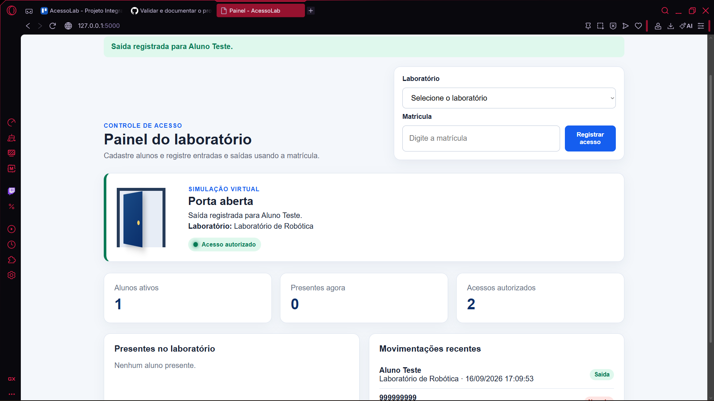
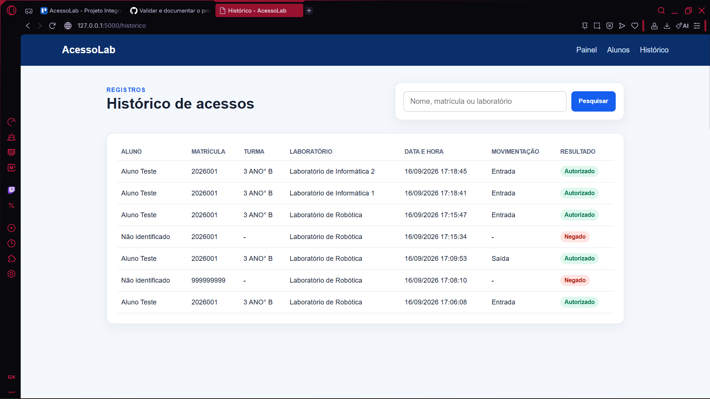

# Relatório de Validação - AcessoLab

## 1. Objetivo

Validar o funcionamento do protótipo virtual do AcessoLab, incluindo cadastro, seleção de laboratório, controle de acesso, simulação da porta e armazenamento no SQLite.

## 2. Ambiente

- Computador com Python 3;
- navegador web;
- aplicação Flask;
- banco de dados SQLite;
- execução local em `http://127.0.0.1:5000`.

> A validação desta versão é exclusivamente de software. Não foi utilizado ESP32, servo motor ou circuito físico.

## 3. Casos de teste

| Código | Procedimento                              | Resultado esperado                                      | Resultado obtido                                         | Situação |
| ------ | ----------------------------------------- | ------------------------------------------------------- | -------------------------------------------------------- | -------- |
| T01    | Cadastrar aluno com todos os campos.      | Cadastro salvo.                                         | Aluno cadastrado corretamente.                           | Aprovado |
| T02    | Repetir uma matrícula cadastrada.         | Sistema informa duplicidade.                            | Mensagem de matrícula já cadastrada exibida.             | Aprovado |
| T03    | Registrar matrícula ativa.                | Entrada registrada, sinal verde e porta virtual aberta. | Entrada registrada e porta virtual aberta.               | Aprovado |
| T04    | Repetir a matrícula no mesmo laboratório. | Saída registrada.                                       | Saída registrada corretamente.                           | Aprovado |
| T05    | Informar matrícula inexistente.           | Acesso negado, sinal vermelho e porta bloqueada.        | Acesso negado e porta bloqueada.                         | Aprovado |
| T06    | Desativar um aluno e tentar acessar.      | Acesso negado.                                          | Matrícula inativa teve o acesso negado.                  | Aprovado |
| T07    | Testar os três laboratórios.              | Laboratório correto salvo em cada registro.             | Os três laboratórios foram registrados corretamente.     | Aprovado |
| T08    | Pesquisar nome, matrícula e laboratório.  | Registros correspondentes exibidos.                     | A pesquisa exibiu os registros correspondentes.          | Aprovado |
| T09    | Reiniciar a aplicação.                    | Registros anteriores permanecem no banco.               | Os registros permaneceram salvos após a reinicialização. | Aprovado |
| T10    | Abrir em uma tela menor.                  | Interface continua utilizável.                          | Interface permaneceu visível e utilizável.               | Aprovado |

## 4. Evidências

### Cadastro do aluno

### Acesso autorizado

### Saída registrada

### Acesso negado

### Histórico de acessos

### Registros dos laboratórios

## 5. Validação com usuário
**Pessoa que realizou o teste:** Colega de turma
**Data:** 16/09/2026
**Contexto:** Demonstração e utilização do protótipo virtual do AcessoLab.

### Feedback recebido

O usuário considerou o sistema fácil, direto e simples de utilizar. As mensagens de acesso autorizado e negado foram consideradas claras, e a seleção dos laboratórios ficou compreensível. Como melhoria futura, foi sugerida a integração do AcessoLab com os laboratórios da escola, permitindo sua utilização em um contexto real.

## 6. Problemas e correções

| Problema encontrado                                               | Correção realizada                         | Resultado após correção                  |
| ----------------------------------------------------------------- | ------------------------------------------ | ---------------------------------------- |
| Nenhum problema crítico foi encontrado durante a validação final. | Não foi necessária uma correção adicional. | Todos os casos de teste foram aprovados. |

## 7. Conclusão

Os dez casos de teste foram executados e aprovados. O protótipo virtual cadastrou alunos, validou matrículas, registrou entradas e saídas, diferenciou os três laboratórios e manteve os dados armazenados após a reinicialização. A interface também permaneceu utilizável em uma tela menor. Dessa forma, o AcessoLab cumpriu o objetivo da demonstração, tendo como principal limitação a ausência da integração com equipamentos físicos, que poderá ser implementada futuramente.
